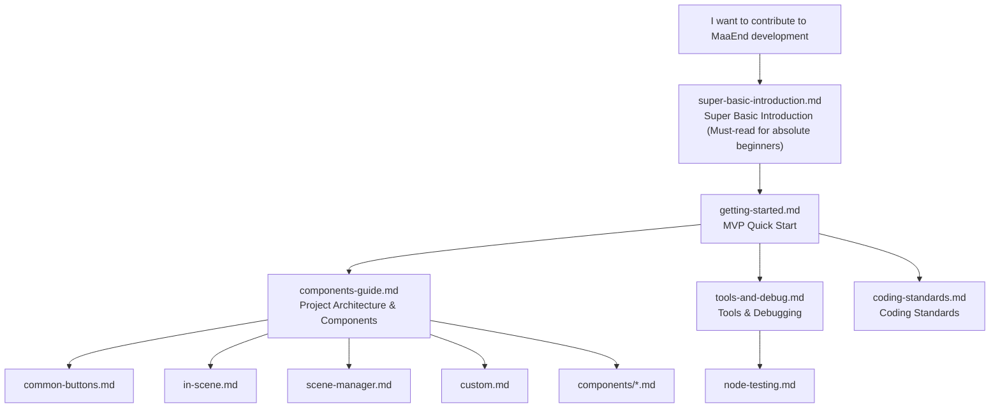

# MaaEnd Developer Documentation

This directory contains all developer documentation for the MaaEnd project.

## Reading Path

It is recommended to read in the following order:

1.  Absolutely zero background; get confused seeing `git clone`, `pnpm install` → `super-basic-introduction.md`
2.  Set up the environment, get it running, make a change → `getting-started.md`
3.  Understand the project architecture and reusable nodes → `components-guide.md`
4.  Master development tools and debugging workflow → `tools-and-debug.md`
5.  Consult the coding standards → `coding-standards.md`
6.  When you need to write test sets → `node-testing.md`
7.  When using a specific advanced component → Refer to the corresponding document under `components/`
8.  When maintaining a specific task → Refer to the corresponding document under `tasks/`

## Documentation Index

### Tier 1 — Quick Start

| Document                                                  | Description                                                                              |
| --------------------------------------------------------- | ---------------------------------------------------------------------------------------- |
| [Super Basic Introduction](./super-basic-introduction.md) | For absolute beginners: What are Git, terminal, VS Code, JSON, and how to use them       |
| [Getting Started](./getting-started.md)                   | Set up the environment, run the program, make your first change and PR within 10 minutes |

### Tier 2 — Reference Manual

| Document                                                          | Description                                                                      |
| ----------------------------------------------------------------- | -------------------------------------------------------------------------------- |
| [DeepWiki — MaaEnd](https://deepwiki.com/MaaEnd/MaaEnd)           | Online project documentation overview with AI                                    |
| [Components Guide](./components-guide.md)                         | Project architecture, identifying what to change, reusable node catalog          |
| [Tools & Debugging](./tools-and-debug.md)                         | Development tools checklist, common debugging entry points, community group info |
| [Node Testing](./node-testing.md)                                 | How to write and run node tests to verify stable recognition hits                |
| [Pipeline Protocol](https://maafw.com/docs/3.1-PipelineProtocol/) | Full text of the official MaaFramework Pipeline Protocol                         |

### Tier 3 — Standards & Constraints

| Document                                  | Description                                                          |
| ----------------------------------------- | -------------------------------------------------------------------- |
| [Coding Standards (Must-read)](./coding-standards.md) | Pipeline / Go / Cpp coding rules, pre-commit checks, common pitfalls |

### Pipeline Basic Components

The most commonly used reusable nodes in daily development. All Pipeline developers are advised to consult these for reuse during development.

| Document                                            | Description                                                                                                 |
| --------------------------------------------------- | ----------------------------------------------------------------------------------------------------------- |
| [Common Buttons](./common-buttons.md)               | White/Yellow confirm, cancel, close, teleport, and other generic button nodes                               |
| [InScene Scene Recognition](./in-scene.md)          | Universal scene recognition, determines the scene of the current screen                                     |
| [SceneManager Scene Navigation](./scene-manager.md) | Universal navigation mechanism, automatically navigates/teleports from any interface to the target scene/UI |
| [Custom Actions & Recognition](./custom.md)         | Public Custom nodes such as SubTask, ClearHitCount, ExpressionRecognition, etc.                             |

### Advanced Component Reference (`components/`)

Consult as needed. Only required when using the corresponding component.

| Document                                                                      | Description                                                                                              |
| ----------------------------------------------------------------------------- | -------------------------------------------------------------------------------------------------------- |
| [AutoFight Automatic Combat](./components/auto-fight.md)                      | In-battle automatic operation module, automatically completes normal attacks, skills, chain skills, etc. |
| [CharacterController Character Control](./components/character-controller.md) | Character perspective rotation, movement, and automatic movement facing the target                       |
| [BetterSliding Quantitative Sliding](./components/better-sliding.md)          | Common custom action for adjusting discrete quantity sliders by target value                             |
| [MapLocator Minimap Positioning](./components/map-locator.md)                 | Minimap positioning system based on AI + CV, outputs area, coordinates, and orientation                  |
| [MapTracker Minimap Tracking](./components/map-tracker.md)                    | Computer vision-based minimap tracking and path movement                                                 |
| [MapNavigator Path Navigation](./components/map-navigator.md)                 | High-precision automatic navigation Action, comes with a GUI recording tool                              |

### Task Maintenance Documentation (`tasks/`)

Only required when maintaining the corresponding task.

| Document                                                                                   | Description                                                                                               |
| ------------------------------------------------------------------------------------------ | --------------------------------------------------------------------------------------------------------- |
| [AutoStockpile Automatic Stockpiling](./tasks/auto-stockpile-maintain.md)                  | Product template, product mapping, price threshold, and region expansion maintenance                      |
| [DijiangRewards Infrastructure Task](./tasks/dijiang-rewards-maintain.md)                  | Main process, stage responsibilities, and interface option override logic                                 |
| [CreditShopping Credit Shop](./tasks/credit-shopping-maintain.md)                          | Purchase priority, credit linkage, refresh strategy, and product extension                                |
| [EnvironmentMonitoring Environment Monitoring](./tasks/environment-monitoring-maintain.md) | Observation point route data, `pipeline-generate` automatic generation, and new point integration process |

### Third-Party Protocol Documentation (`protocol/`)

Defines the format specifications for files written by MaaEnd, for reliable reading by external tools (data analysis dashboards, web frontends, etc.).

| Document                                                                                | Description                                                            |
| --------------------------------------------------------------------------------------- | ---------------------------------------------------------------------- |
| [AutoStockpile Daily Price Record](../protocol/autostockpile-daily-storage/protocol.md) | `ElasticGoodsPrices.json` file format, path parsing, and writing rules |

## Quick Navigation

| What I want to do                               | Where to look                                                                                                                                                   |
| ----------------------------------------------- | --------------------------------------------------------------------------------------------------------------------------------------------------------------- |
| Absolute beginner, don't understand terminology | [super-basic-introduction.md](./super-basic-introduction.md)                                                                                                    |
| First time participating, starting from scratch | [getting-started.md](./getting-started.md)                                                                                                                      |
| Understand the project architecture             | [components-guide.md](./components-guide.md)                                                                                                                    |
| Modify Pipeline nodes                           | [components-guide.md](./components-guide.md) → [common-buttons.md](./common-buttons.md) / [in-scene.md](./in-scene.md) / [scene-manager.md](./scene-manager.md) |
| Write or debug Go Service                       | [components-guide.md](./components-guide.md) → [custom.md](./custom.md)                                                                                         |
| Consult coding standards                        | [coding-standards.md](./coding-standards.md)                                                                                                                    |

## Communication

Development QQ Group: [1072587329](https://qm.qq.com/q/EyirQpBiW4) (Work group, welcome to join for development collaboration, but user issues are not handled here)

## AI Automatic Sync

- Corresponding GitHub Action is at: `.github/workflows/docs-sync.yml`
- Purpose: After manual trigger, it first fixes a repository snapshot, then based on the Chinese source file hash recorded in `docs/en_us/.docs-sync-state.json`, finds the `docs/zh_cn/**` documents that need syncing in that snapshot, translates the corresponding content to `docs/en_us/**`, and finally the bot automatically creates a PR.
- Current mode: Manual `workflow_dispatch` only; automatic triggers are currently commented out and disabled.
- Limitations: The LLM acts only as a per-file translator; diff collection, document link rewriting, file writing, modification scope validation, branch pushing, and PR creation are all handled by scripts and the workflow.
- Translation script: `tools/docs/translate_with_llm.py`
- Runtime dependencies: A `DOCS_TRANSLATION_CONFIG` secret; `MAAEND_BOT_TOKEN` is optional, uses the GitHub Actions built-in `GITHUB_TOKEN` if not configured.
- `DOCS_TRANSLATION_CONFIG` contains translation endpoint configuration: `api_key`, `model`, `base_url`, optional `api_style` (`openai`, `anthropic`, or `gemini`), and `max_tokens`.
- Optional backend: Can select `translator=copilot` during manual trigger, using `COPILOT_GITHUB_TOKEN` in that case; default is `translator=config`, Copilot is not used normally.
- `pr_branch` can only use the `chore/docs-auto-sync*` prefix and cannot equal the default branch name.
